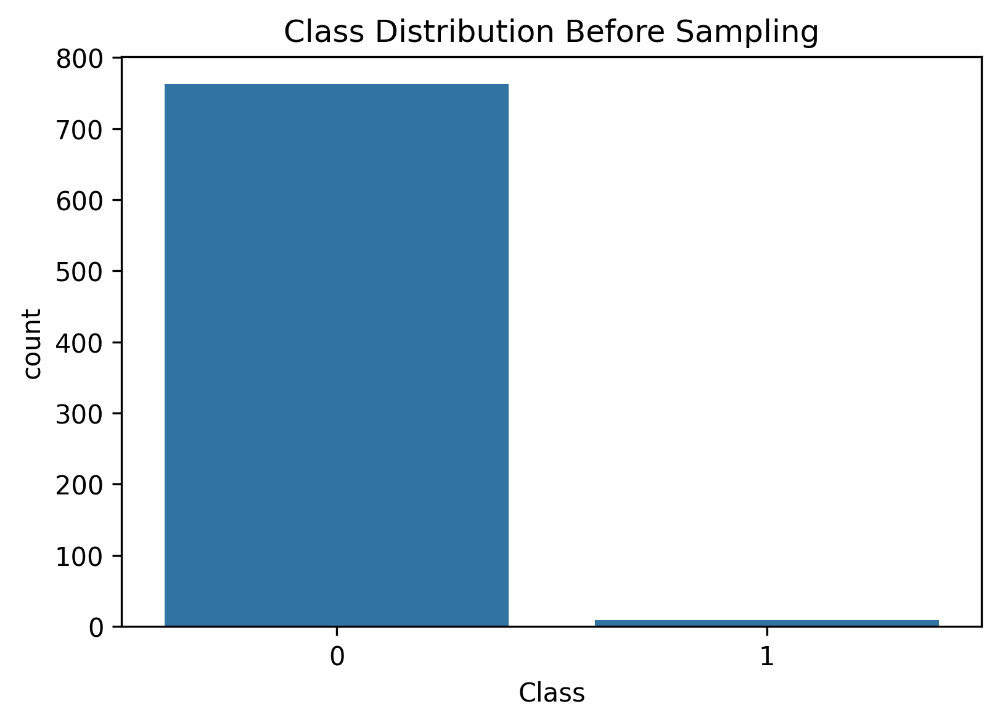
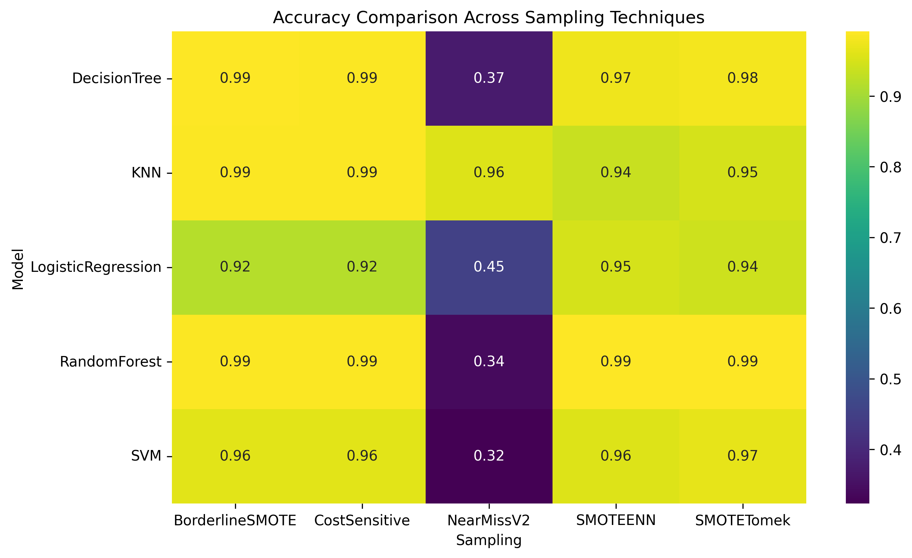
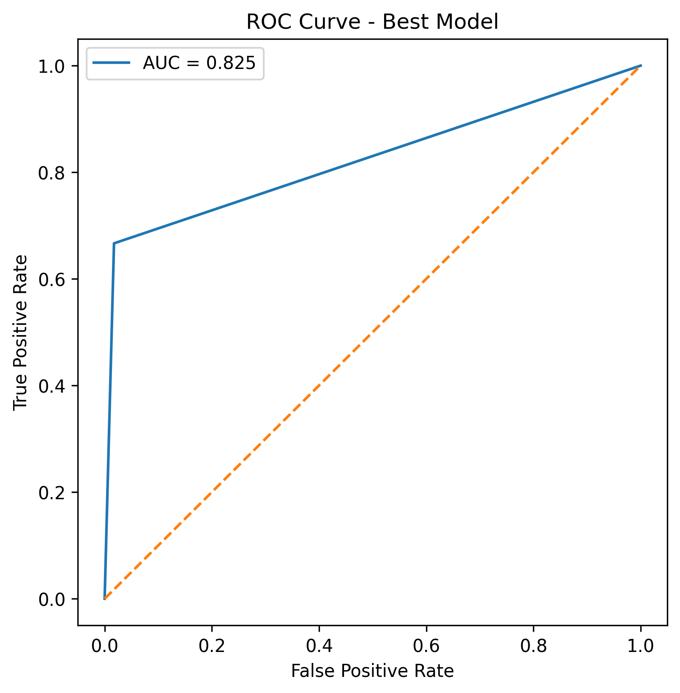
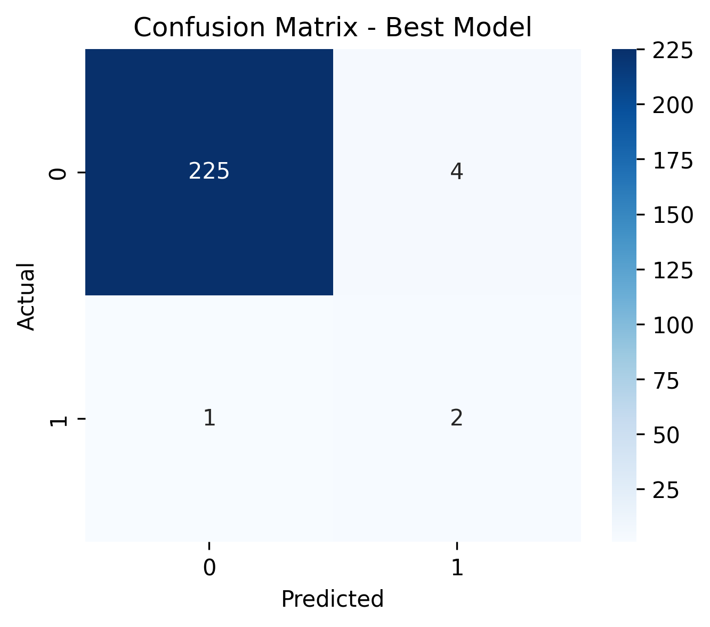

# Credit Card Fraud Detection using Advanced Sampling Techniques

##  Project Overview

This project analyzes the impact of advanced sampling techniques on machine learning performance in an imbalanced credit card fraud detection dataset.

Fraud detection datasets typically suffer from severe class imbalance, where fraudulent transactions represent a very small percentage of total observations. This study evaluates how different resampling strategies and cost-sensitive learning approaches influence classification performance.

The objective is to systematically compare multiple sampling techniques across several machine learning models using consistent preprocessing and evaluation metrics.

---

##  Project Structure

```
credit-card-imbalance-study/
│
├── data/
│   └── Creditcard_data.csv
│
├── outputs/
│   ├── class_distribution.png
│   ├── accuracy_heatmap.png
│   ├── roc_curve.png
│   ├── confusion_matrix_best_model.png
│   ├── results_table.csv
│   └── accuracy_table.csv
│
├── Credit_Card_Imbalance_Study.ipynb
├── requirements.txt
└── README.md
```

---

##  Dataset Information

- Dataset: Credit Card Transaction Dataset  
- Target Variable: `Class`  
    - `0` → Legitimate Transaction  
    - `1` → Fraudulent Transaction  
- Nature: Highly Imbalanced  

The dataset was downloaded and stored locally inside the `data/` directory for reproducibility.

---

##  Sampling Techniques Evaluated

1. **SMOTETomek**  
   Hybrid oversampling combined with Tomek Links boundary cleaning.

2. **SMOTEENN**  
   Synthetic Minority Oversampling combined with Edited Nearest Neighbors.

3. **BorderlineSMOTE**  
   Focused synthetic generation near decision boundaries.

4. **NearMiss (Version 2)**  
   Intelligent majority class undersampling strategy.

5. **Cost-Sensitive Learning**  
   Model-level class weighting without modifying dataset distribution.

---

##  Machine Learning Models Used

- Logistic Regression  
- Decision Tree  
- Random Forest  
- K-Nearest Neighbors  
- Support Vector Machine  

All models were trained using identical train-test splits and standardized features.

---

##  Evaluation Metrics

Model performance was evaluated using:

- Accuracy  
- Precision  
- Recall  
- F1-Score  
- ROC-AUC  

Given the imbalance nature of the dataset, F1-Score and ROC-AUC were emphasized for comparison.

---

##  Class Distribution (Before Sampling)



---

##  Accuracy Comparison Heatmap



---

##  ROC Curve (Best Performing Model)



---

##  Confusion Matrix (Best Performing Model)



---

##  Downloadable Results

-  Full Evaluation Metrics Table  
  [Download results_table.csv](outputs/results_table.csv)

-  Accuracy Pivot Table  
  [Download accuracy_table.csv](outputs/accuracy_table.csv)

These tables contain complete performance comparisons across all sampling-model combinations.

---

##  Key Observations

- Hybrid sampling techniques improved decision boundary clarity.
- Cost-sensitive learning performed competitively without altering dataset distribution.
- Ensemble models demonstrated stable performance across sampling methods.
- Sampling technique selection significantly influences classifier behavior in imbalanced datasets.

---

##  How to Run the Project

1. Clone the repository:

```bash
git clone <your-repository-link>
cd credit-card-imbalance-study
```

2. Install dependencies:

```bash
pip install -r requirements.txt
```

3. Launch Jupyter Notebook:

```bash
jupyter notebook
```

4. Open and run:

```
Credit_Card_Imbalance_Study.ipynb
```

---

##  Conclusion

This study demonstrates that advanced hybrid sampling strategies and cost-sensitive learning approaches provide robust solutions for imbalanced classification problems. Model behavior varies significantly depending on the chosen resampling technique, reinforcing the importance of systematic experimentation in fraud detection systems.

---

##  Author

Yash Sharma  
Machine Learning & Data Science Enthusiast
